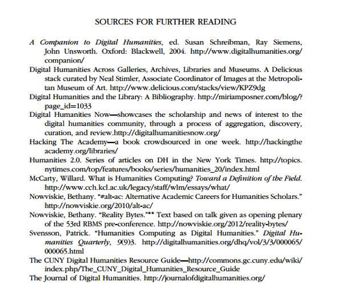

# Digital Humanities Ready Reference 

## General DH Websites and Guides  

- arts-humanities.net: guide to digital humanities & arts   
	[http://www.arts-humanities.net/](http://www.arts-humanities.net/)  
- Digital.Humanities@Oxford   
	[http://digital.humanities.ox.ac.uk/](http://digital.humanities.ox.ac.uk/)  
- “Why Digital Humanities?”   
	[http://digitalscholarship.files.wordpress.com/2011/10/dhglca-5.pdf]([http://digitalscholarship.files.wordpress.com/2011/10/dhglca-5.pdf)  

## Connect  

- ACRL Digital Humanities Interest Group   
	[http://www.ala.org/acrl/aboutacrl/directoryofleadership/interestgroups/acr-igdh](http://www.ala.org/acrl/aboutacrl/directoryofleadership/interestgroups/acr-igdh)  
- ACRL DH+Lib   
	[http://acrl.ala.org/dh/](http://acrl.ala.org/dh/)  
- DHThis   
	[http://dhthis.org/](http://dhthis.org/)  
- iSchools and the Digital Humanities   
	[http://www.ischooldh.org/](http://www.ischooldh.org/)  

## Notable DH Projects

- British Library- UK Soundmap   
	[http://sounds.bl.uk/sound-maps/uk-soundmap](http://sounds.bl.uk/sound-maps/uk-soundmap)  
- Anglo-American Legal Tradition   
	[http://aalt.law.uh.edu/](http://aalt.law.uh.edu/)   
- The Rossetti Archive | University of Virginia   
	[http://www.rossettiarchive.org/](http://www.rossettiarchive.org/)  
- The Walt Whitman Archive | University of Nebraska   
	[http://www.whitmanarchive.org/]  
- Emory Women Writers Resource Project | Emory University    
	[http://womenwriters.library.emory.edu/](http://womenwriters.library.emory.edu/)   

## Publications  

- Digital Humanities Quarterly    
	[http://www.digitalhumanities.org/dhq/](http://www.digitalhumanities.org/dhq/)   
- Literary and Linguistic Computing   
	[http://llc.oxfordjournals.org/](http://llc.oxfordjournals.org/)   
- Digital Humanities Now    
	[http://digitalhumanitiesnow.org/](http://digitalhumanitiesnow.org/)   
- International Journal of Humanities and Arts Computing    
	[http://www.euppublishing.com/journal/ijhac](http://www.euppublishing.com/journal/ijhac)   

## Digital Humanities Centers   

- The Catapult Center for Digital Humanities and Computational Analysis of Texts | Indiana University, Bloomington 
	[http://www.indiana.edu/~catapult/ ](http://www.indiana.edu/~catapult)   
- The Center for Digital Humanities | University of California, Los Angeles    
	[http://www.digitalhumanities.ucla.edu/](http://www.digitalhumanities.ucla.edu/)   
- Maryland Institute for Technology in the Humanities (MITH) | University of Maryland, College Park   
	[http://mith.umd.edu/](http://mith.umd.edu/)   
- Digital Scholarship Commons (DiSC) | Emory University   
	[http://old.web.library.emory.edu/disc](http://old.web.library.emory.edu/disc)   
- Scholar’s Lab | University of Virginia   
	[http://www.scholarslab.org/](http://www.scholarslab.org/)   
- Center for Digital Research in the Humanities (CDRH) | University of Nebraska, Lincoln    
	[http://cdrh.unl.edu/](http://cdrh.unl.edu/)   
- The Center for Digital Humanities and Social Sciences (MATRIX) | Michigan State University   
	[http://www2.matrix.msu.edu/](http://www2.matrix.msu.edu/)  

## Toolkits  

- Digital Research Tools (DiRT)   
	[https://digitalresearchtools.pbworks.com/w/page/17801672/FrontPage](https://digitalresearchtools.pbworks.com/w/page/17801672/FrontPage)  
- Omeka   
	[https://omeka.org/](https://omeka.org/)   
- MAchine Learning for LanguagE Toolkit    
	[http://mallet.cs.umass.edu/](http://mallet.cs.umass.edu/)   

## Bloggers

- Ted Underwood   
	[http://tedunderwood.com/](http://tedunderwood.com/)   
- Bethany Nowviskie   
	[http://nowviskie.org/](http://nowviskie.org/)   
- Matthew Kirschenbaum    
	[http://mkirschenbaum.wordpress.com/](http://mkirschenbaum.wordpress.com/)   
- Melissa Terras   
	[http://melissaterras.blogspot.com/](http://melissaterras.blogspot.com/)   
- Stephen Ramsay   
	[http://stephenramsay.us/](http://stephenramsay.us/)   

## Suggested Reading 

From Vandegrift and Varner’s excellent article, [“Evolving in Common: Creating Mutually Supportive Relationships Between Libraries and the Digital Humanities” (Journal of Library Administration, Jan 2013)](http://www.academia.edu/2868249/Evolving_in_common_Creating_mutually_supportive_relationships_between_libraries_and_the_digital_humanities): 

